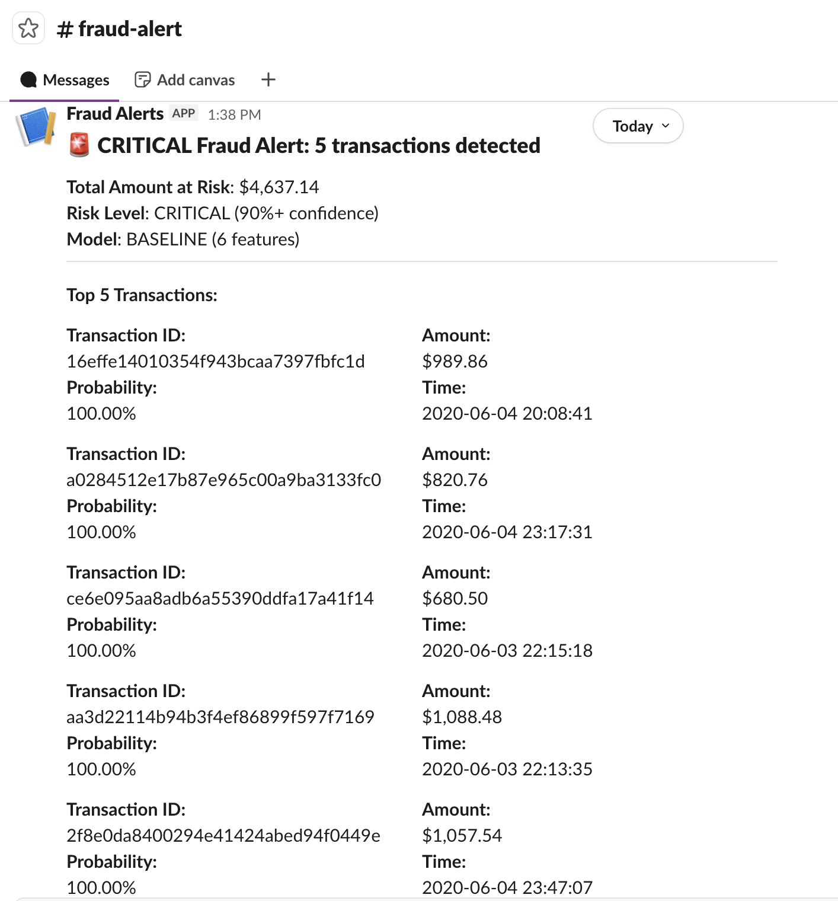

# Fraud Detection Pipeline

An end-to-end ML pipeline for detecting fraudulent credit card transactions using Snowflake, dbt, and Python.

> **What this project taught me:** More features ≠ better models. The 6-feature baseline outperformed the 15-feature model, and investigating why uncovered real issues: feature leakage from point-in-time aggregation, label-derived inputs, and ID columns fed to the classifier. Those lessons — not the precision score — are the main takeaway here. Details in the [Key Learnings](#key-learnings) section.

## Project Context

- Complete data pipeline from raw data to predictions (1.3M Kaggle transactions)
- Modern data stack: Snowflake, dbt, Python, Snowflake Cortex ML
- Iterative feature engineering: built in two phases, then compared results
- Automated Slack alerting for high-risk transactions

## What This Pipeline Does

1. Loads 1.3M transaction records from Kaggle into Snowflake
2. Engineers 15 features using dbt (amount patterns, velocity, time, location)
3. Trains a classification model using Snowflake Cortex ML
4. Scores transactions and assigns risk levels
5. Sends Slack alerts for high-risk transactions

## Architecture

```
Kaggle Dataset (CSV)
        ↓
Python Data Loader
        ↓
Snowflake RAW Layer
        ↓
dbt Transformations
  - stg_transactions (clean data)
  - int_features (15 engineered features)
  - fct_fraud_features (final feature table)
        ↓
Snowflake Cortex ML
  - Train classifier
  - Generate predictions
        ↓
fct_fraud_predictions (scored transactions)
        ↓
Python Alert Script → Slack
```

## Tech Stack

- **Data Warehouse**: Snowflake
- **Transformation**: dbt
- **Language**: Python 3.10+
- **ML**: Snowflake Cortex ML
- **Alerting**: Slack webhooks
- **Testing**: pytest + dbt tests

## Dataset

Using the **Kaggle Credit Card Fraud Detection Dataset**:
- **Creator**: [Kartik Shenoy](https://www.kaggle.com/kartik2112)
- **Source**: https://www.kaggle.com/datasets/kartik2112/fraud-detection
- 1.3M transactions from 2019-2020
- ~0.17% fraud rate (imbalanced)
- Simulated data for education/research
- Generated using [Sparkov Data Generation](https://github.com/namebrandon/Sparkov_Data_Generation) tool by Brandon Harris

## Features

### Phase 1 (10 features)
- **Amount**: transaction_amount, customer_avg_amount, amount_z_score
- **Velocity**: txns_last_24h, txns_last_7d, minutes_since_last_txn
- **Time**: hour_of_day, is_weekend
- **Customer**: customer_age, merchant_category

### Phase 2 (5 features)
- is_different_city
- is_new_max_amount
- merchant_fraud_rate
- is_late_night
- account_age_days

See `docs/FEATURE_NOTES.md` for rationale and implementation details.

## Quick Start

### 1. Prerequisites

- Python 3.10+
- Snowflake account (free trial works)
- Kaggle account
- Slack workspace (optional)

### 2. Installation

```bash
git clone https://github.com/Vignesh-Hariharan/fraud-detection-pipeline.git
cd fraud-detection-pipeline

python -m venv venv
source venv/bin/activate  # Windows: venv\Scripts\activate

pip install -r requirements.txt
```

### 3. Configuration

Set up Kaggle credentials:
```bash
mkdir -p ~/.kaggle
# Download kaggle.json from https://www.kaggle.com/settings/account
mv ~/Downloads/kaggle.json ~/.kaggle/
chmod 600 ~/.kaggle/kaggle.json
```

Set up environment variables:
```bash
cp .env.example .env
# Edit .env with your credentials
```

### 4. Initialize Snowflake

Run setup scripts in Snowflake console:
```sql
-- Execute sql/01_setup_snowflake.sql
-- Execute sql/02_setup_rbac.sql (optional)
```

### 5. Load Data

```bash
python scripts/load_data.py
```

Expected: ~1.3M rows loaded, fraud rate 0.17%

### 6. Run dbt Models

```bash
cd dbt_project
cp profiles.yml.example ~/.dbt/profiles.yml
# Edit ~/.dbt/profiles.yml if needed

dbt run
dbt test
```

### 7. Train Models (Iterative)

```bash
# Train baseline
# Execute ml/baseline_model.sql in Snowflake

# Train experiments
# Execute ml/experiments.sql in Snowflake

# Train full model
# Execute ml/train_model.sql in Snowflake

# Compare all models
python scripts/compare_models.py
```


### 8. Generate Predictions

```bash
# Execute ml/generate_predictions.sql in Snowflake
```

### 9. Evaluate Model

```bash
python scripts/evaluate_model.py
```

### 10. Send Alerts (Optional)

```bash
# Test mode
python scripts/slack_alert.py --dry-run

# Send actual alerts
python scripts/slack_alert.py
```

## Model Experiments & Performance

I trained 4 different models iteratively, adding features incrementally:

1. **Baseline** (6 features): Amount patterns + basic time
2. **With Velocity** (9 features): + transaction frequency metrics
3. **With Customer/Time** (13 features): + customer age, account age, time patterns
4. **Full Features** (15 features): + geography, merchant risk

### Results

After running all 4 experiments:

```
Model                     Features    Precision    Recall       F1        
--------------------------------------------------------------------------------
BASELINE                  6           82.9%        74.7%        78.6%     (best)
EXP2 (+ velocity)         9           75.5%        77.2%        76.3%
EXP3 (+ customer/time)    13          76.9%        80.2%        78.5%
FULL (all features)       15          74.2%        76.6%        75.4%

Best Model: BASELINE (6 features)
Why: Highest F1 score + simplest (least prone to overfitting)
```

**Key Finding**: More features didn't help. The baseline model with only 6 core features outperformed the complex models:
- Simpler is often better (avoids overfitting)
- Feature selection matters more than quantity
- Not all engineered features add value


## Project Structure

```
fraud-detection-pipeline/
├── config/                          # Snowflake config templates
├── data/                            # Dataset location
│   ├── sample_transactions.csv      # Sample for inspection
│   └── DATA_DICTIONARY.md           # Dataset documentation
├── dbt_project/                     # dbt transformation layer
│   ├── models/
│   │   ├── staging/                 # Clean raw data
│   │   ├── intermediate/            # Feature engineering
│   │   └── marts/                   # Final tables
│   └── schema.yml                   # dbt tests
├── docs/                            # Documentation
│   ├── FEATURE_NOTES.md             # Feature engineering rationale
│   └── images/                      # Screenshots
├── ml/                              # ML training and scoring
│   ├── train_model.sql              # Cortex ML training
│   ├── generate_predictions.sql     # Score test set
│   └── evaluate_model.sql           # Performance queries
├── scripts/                         # Python utilities
│   ├── load_data.py                 # Kaggle → Snowflake loader
│   ├── slack_alert.py               # Alert system
│   ├── evaluate_model.py            # Model evaluation
│   ├── run_pipeline.py              # End-to-end orchestration
│   └── utils/                       # Shared utilities
├── sql/                             # Database setup
│   ├── 01_setup_snowflake.sql       # Create database/schemas
│   └── 02_setup_rbac.sql            # Role-based access
├── tests/                           # Python tests
└── requirements.txt                 # Dependencies
```

## Running the Full Pipeline

Automated execution:
```bash
python scripts/run_pipeline.py
```

This runs:
1. dbt transformations
2. Data quality checks
3. Prediction generation
4. Alert system

Can be scheduled with cron:
```bash
# Run daily at 6 AM
0 6 * * * cd /path/to/project && ./venv/bin/python scripts/run_pipeline.py
```

## Slack Alerts

The pipeline automatically alerts on CRITICAL risk transactions (90%+ fraud confidence).

### Example Alert



### How It Works

1. **Query high-risk transactions** from Snowflake
2. **Format alert message** with transaction details
3. **Send to Slack** via webhook
4. **Includes**: Transaction ID, amount, probability, timestamp

### Run Alert Script

```bash
# Preview what would be sent (no actual alert)
python scripts/slack_alert.py --limit 5 --dry-run

# Send actual alert for top 5 critical transactions
python scripts/slack_alert.py --limit 5
```

### Production Considerations

This demo uses batch processing on historical data. In production, you would:
- Integrate with streaming data (Kafka, Snowpipe)
- Trigger alerts in real-time as transactions occur
- Add limits to prevent sending too many alerts (which people start to ignore)
- Include investigation links and action buttons

## Key Learnings

### The Main Finding: Why the Simpler Model Won

The 15-feature model underperformed the 6-feature baseline. Investigating why revealed three compounding problems:

1. **Point-in-time leakage** — `customer_avg_amount`, `amount_z_score`, and velocity features were computed in dbt over the *full* dataset before the train/test split. Training rows could therefore see statistics that included future test-window transactions.
2. **Label-derived input** — `merchant_fraud_rate` is computed directly from the fraud label column across the full dataset. This means the model trained on a variable that already encodes the answer for some rows.
3. **ID columns passed to Cortex** — training tables included transaction ID and timestamp columns, which Cortex treated as numeric inputs, adding noise.

A production version would compute all aggregations point-in-time over the training window only, exclude ID columns, and compute merchant risk rates on training rows only. These are standard safeguards that this project skipped — and the model results made the gap visible.

**Why this is worth showing:** Catching this kind of leakage after the fact — and being able to explain exactly *why* the simpler model won — demonstrates the diagnostic thinking that matters in production ML work.

### What Worked
- **Iterative approach**: Starting simple and adding features incrementally
- **Time-based split**: Training on older data (before Oct 2020), testing on newer data (Oct 2020+)
- **Feature comparison**: Actually measuring which features help vs hurt
- **Finding the right cutoff**: Testing different confidence thresholds for fraud flagging
- **dbt for features**: SQL-based feature engineering is fast, readable, and testable

### What I'd Do Differently
- Compute all aggregations point-in-time using only training-window data
- Exclude ID and timestamp columns from Cortex inputs
- Compute `merchant_fraud_rate` from training rows only
- Test more time windows (6h, 48h, 30d) for velocity features
- Add multiple evaluation folds rather than a single train/test split

## Limitations

This is a portfolio project, not production-ready. Known limitations:

1. **Batch processing only** - no real-time scoring
2. **No performance tracking** - model accuracy could get worse over time (as fraud patterns change) without us noticing
3. **Limited ML tuning** - using Cortex defaults
4. **Simulated data** - patterns may differ from real fraud
5. **No orchestration** - manual execution or basic scheduling
6. **Limited testing** - happy path focused
7. **Feature engineering gaps** - see [Key Learnings](#key-learnings) for a full breakdown of the leakage issues discovered and what a production version would do differently.


## Security Note

All credentials are stored in:
- `.env` file (git-ignored)
- Environment variables
- `config/*.yml` files (git-ignored)

Never commit:
- `.env`
- `config/snowflake_config.yml`
- `dbt_project/profiles.yml`
- Kaggle credentials

Use the `.example` template files instead.

## Testing

Run Python tests:
```bash
pytest tests/
```

Run dbt tests:
```bash
cd dbt_project
dbt test
```

## Documentation

- `docs/FEATURE_NOTES.md` - Feature engineering rationale and implementation
- Dataset: [Kaggle Credit Card Fraud Detection](https://www.kaggle.com/datasets/kartik2112/fraud-detection)

## Future Enhancements

Priority improvements for production:
1. Real-time scoring with Snowpipe and Tasks
2. Automated model retraining pipeline
3. Track model performance over time and get alerts when accuracy drops
4. Interactive fraud dashboard
5. Orchestration with Airflow/Prefect

## About

Portfolio project covering data engineering (loading, transformation, quality
checks), the ML workflow (training, evaluation, prediction), and automation
(alerts and monitoring) on Snowflake, dbt, and Python.

## License

This project is for portfolio demonstration purposes. The underlying Kaggle dataset is licensed under CC0: Public Domain.

